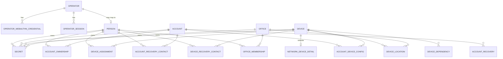

# Annex C: Detailed Data Model

**Companion to the preliminary design.** Defines the exact storage model: entities, fields, types, states, and the full relationship catalog. This is the foundation that the audit log (Annex B), permissions (Annex D), and alert engine (Annex E) build on.

Target stack: Django models over PostgreSQL.

> **Changes in this version (v2):** Primary keys fixed to UUID v4. Relationships moved from a single generic edge table to explicit join tables with database-enforced integrity. Multi-owner accounts confirmed for v1. Per-NIC and richer network detail deferred to v2. IPAM (network segments) deferred. Custom field visibility for Viewer clarified.

---

## 1. Design principles

- **One app, one database.** Every table maps to a Django model.
- **Primary keys are UUID v4.** Non-enumerable, no extension needed (`gen_random_uuid()` or `uuid.uuid4`). At this system's scale the random-key insert cost is not perceptible.
- **No hard deletes.** Lifecycle is expressed through `state`. Rows are never deleted, to keep the audit chain intact. "Removal" means a terminal state, never a `DELETE`.
- **All timestamps are `timestamptz` in UTC.**
- **Two distinct user concepts, do not conflate them:**
  - **Operator:** the 1 to 2 people who log in (roles Administrator and Viewer). Subject of authentication.
  - **Person:** an employee record being inventoried. Subject of data. A Person may or may not be linked to an Operator.
  - `created_by` and `updated_by` always reference Operator, never Person.
- **Secrets never sit in normal columns.** They live in the `secret` table, encrypted per Annex A.
- **Cross-entity links use explicit join tables, one per relationship type,** with real foreign keys. The database enforces which entity types a link connects. The cost, accepted as a decision, is that the alert engine queries several tables instead of one, and a new relationship type means a new table and migration.
- **Extensibility via `custom_fields` (JSONB)** on each core entity, described by `field_definition` rows so the UI renders typed inputs.

---

## 2. Common fields (base mixin)

Every core entity (Person, Account, Device, Office) carries these:

| Field | Type | Req | Notes |
|---|---|---|---|
| id | uuid PK | yes | v4 |
| state | text (enum per entity) | yes | check-constrained |
| notes | text | no | free text |
| custom_fields | jsonb | yes | default `'{}'` |
| created_at | timestamptz | yes | default `now()` |
| updated_at | timestamptz | yes | set on every write |
| created_by | uuid FK operator | yes | |
| updated_by | uuid FK operator | yes | |

Every join table carries a lighter shared set: `id`, `state` (link_state), `valid_from`, `valid_to`, and the four audit columns.

---

## 3. Enumerations

| Enum | Values |
|---|---|
| operator.role | administrator, viewer |
| person.state | active, suspended, offboarding, terminated |
| account.type | o365, ms_personal, google, samsung, apple_id, odoo, network_admin, external_service, other |
| account.state | active, disabled, compromised, needs_rotation |
| account.mfa_state | enabled, disabled, unknown |
| account.mfa_type (multi) | authenticator_app, sms, voice, email, hardware_key, windows_hello, passkey, unknown |
| device.type | laptop, desktop, phone, tablet, server, firewall, router, switch, access_point, controller, printer, other |
| device.state | in_use, in_storage, pending_repair, broken, decommissioned |
| office.state | active, in_setup, closed |
| network.monitoring_method | snmp, api, none |
| network.health_state | reachable, alerting, offline, unknown |
| secret.kind | password, recovery_codes, pin, passphrase, api_key, wifi_psk, bios_password, disk_recovery_key, totp_seed, snmp_community, other |
| link_state | active, former |
| ownership_role | primary, shared |
| assignment_role | primary_user, temporary |
| config_purpose | setup, mail, mdm, other |
| contact_channel | email, phone, other |
| membership_role | staff, responsible |
| dependency_nature | uplink, power, controller, other |
| field_definition.data_type | string, integer, date, boolean, select, multiselect |

Implementation note: in Django these are `TextChoices` stored as `varchar` with a `CHECK` constraint.

---

## 4. Core entities

### 4.1 operator
| Field | Type | Req | Notes |
|---|---|---|---|
| id | uuid PK | yes | |
| username | text unique | yes | |
| display_name | text | yes | |
| role | text (enum) | yes | administrator or viewer |
| password_hash | text | yes | Argon2id login hash, separate from the vault master key (Annex A) |
| is_active | boolean | yes | default true |
| last_login_at | timestamptz | no | |
| created_at, updated_at | timestamptz | yes | |

### 4.2 operator_webauthn_credential
| Field | Type | Req | Notes |
|---|---|---|---|
| id | uuid PK | yes | |
| operator_id | uuid FK operator | yes | |
| credential_id | bytea unique | yes | |
| public_key | bytea | yes | |
| sign_count | bigint | yes | replay protection |
| label | text | no | |
| created_at | timestamptz | yes | |
| last_used_at | timestamptz | no | |

### 4.3 operator_session
Backs the single-session rule.

| Field | Type | Req | Notes |
|---|---|---|---|
| id | uuid PK | yes | |
| operator_id | uuid FK operator | yes | |
| token_hash | text | yes | hash of the session token, never the token |
| ip | inet | yes | |
| created_at | timestamptz | yes | |
| last_activity_at | timestamptz | yes | drives idle auto-lock |
| revoked_at | timestamptz | no | a new login revokes prior sessions |

### 4.3b session_request
Backs the session handover logistic (Annex D, section 8). State is an enum: pending, granted, denied, expired, cancelled.

| Field | Type | Req | Notes |
|---|---|---|---|
| id | uuid PK | yes | |
| requested_by | uuid FK operator | yes | the operator asking for access |
| current_session_id | uuid FK operator_session | yes | the active session asked to yield |
| state | text (enum) | yes | pending, granted, denied, expired, cancelled |
| requested_at | timestamptz | yes | |
| expires_at | timestamptz | yes | request TTL |
| resolved_at | timestamptz | no | |
| resolved_by | uuid FK operator | no | who released or denied, null if it expired |

### 4.4 person
| Field | Type | Req | Notes |
|---|---|---|---|
| (base mixin) | | yes | state uses person.state |
| full_name | text | yes | |
| internal_code | text unique | no | employee number |
| job_title | text | no | |
| department | text | no | |
| personal_email | text | no | |
| phone | text | no | |
| extension | text | no | |
| hire_date | date | no | |
| exit_date | date | no | |
| operator_id | uuid FK operator | no | links to a login identity, if any |

### 4.5 account
| Field | Type | Req | Notes |
|---|---|---|---|
| (base mixin) | | yes | state uses account.state |
| account_type | text (enum) | yes | |
| label | text | yes | friendly name |
| identifier | text | yes | username, email, or login |
| mfa_state | text (enum) | yes | default unknown |
| mfa_types | text[] | no | array of mfa_type values |
| recovery_email | text | no | |
| recovery_phone | text | no | |
| last_password_change | date | no | drives credential hygiene alert |
| external_source | text | no | for example "graph" |
| external_id | text | no | M365 object id, for matching on sync |

Ownership is the `account_ownership` join table and supports multiple owners. Password and recovery codes live in `secret`.

### 4.6 device
| Field | Type | Req | Notes |
|---|---|---|---|
| (base mixin) | | yes | state uses device.state |
| device_type | text (enum) | yes | |
| brand | text | no | |
| model | text | no | |
| serial_number | text unique | no | |
| asset_tag | text | no | internal inventory tag |
| cpu | text | no | |
| ram_gb | integer | no | |
| storage_gb | integer | no | |
| storage_type | text | no | ssd, hdd, emmc |
| hostname | text | no | |
| mac_addresses | macaddr[] | no | array in v1, per-NIC table deferred to v2 |
| ip_addresses | inet[] | no | array in v1 |
| purchase_date | date | no | |
| warranty_expiry | date | no | drives warranty alert |
| vendor | text | no | |

Phone-specific attributes such as IMEI go in `custom_fields`. Network gear gets a `network_device_detail` row.

### 4.7 network_device_detail
One-to-one extension of `device` for firewalls, routers, switches, access points, and controllers. Kept minimal in v1, expanded in v2.

| Field | Type | Req | Notes |
|---|---|---|---|
| device_id | uuid PK FK device | yes | one to one |
| firmware_version | text | no | |
| last_firmware_update | date | no | |
| monitoring_method | text (enum) | yes | snmp, api, none |
| monitoring_endpoint | text | no | host or URL, not a secret |
| management_url | text | no | |
| health_state | text (enum) | yes | default unknown |
| last_seen_at | timestamptz | no | drives the "down gear" alert |

The SNMP community or API token is a `secret` with `owner_type = device`.

### 4.8 office
| Field | Type | Req | Notes |
|---|---|---|---|
| (base mixin) | | yes | state uses office.state |
| name | text | yes | |
| address | text | no | |
| isp | text | no | |

The responsible person is an `office_membership` row with role `responsible`.

### 4.9 secret
Encrypted material, per Annex A. Polymorphic owner.

| Field | Type | Req | Notes |
|---|---|---|---|
| id | uuid PK | yes | |
| owner_type | text | yes | account, device, office, operator, integration |
| owner_id | uuid | yes | |
| kind | text (enum) | yes | |
| label | text | no | |
| ciphertext | bytea | yes | XChaCha20-Poly1305 output |
| nonce | bytea | yes | 24 bytes |
| dek_wrapped | bytea | yes | DEK wrapped by the master key |
| dek_nonce | bytea | yes | |
| aad_context | text | yes | the AAD bound at encryption time |
| scheme_version | integer | yes | for future upgrades |
| last_rotated_at | timestamptz | no | |
| created_at, updated_at, created_by, updated_by | | yes | |

Revealing a secret is Administrator-only, requires reauthentication, and is logged.

### 4.10 field_definition
Describes a custom field for the UI.

| Field | Type | Req | Notes |
|---|---|---|---|
| id | uuid PK | yes | |
| entity_type | text | yes | person, account, device, office |
| key | text | yes | matches a key inside `custom_fields` |
| label | text | yes | |
| data_type | text (enum) | yes | |
| options | jsonb | no | for select and multiselect |
| required | boolean | yes | default false |
| viewer_visible | boolean | yes | default true, lets you hide a custom field from the Viewer role |
| display_order | integer | yes | |
| active | boolean | yes | default true |

Unique on `(entity_type, key)`. Only Administrator creates or edits definitions. By default Viewer sees all custom fields. Set `viewer_visible` to false to hide a specific one. Secrets are always masked for Viewer regardless. Full per-field rules live in Annex D.

---

## 5. Relationship join tables

Each relationship type is its own table with two foreign keys and database-enforced integrity. All carry the shared link columns: `id`, `state` (link_state), `valid_from`, `valid_to`, and the four audit columns. Ending a relationship sets `state = former` and `valid_to`, it does not delete the row, which preserves history.

| Table | Endpoints | Cardinality and constraints | Extra columns |
|---|---|---|---|
| account_ownership | person_id to account_id | many to many. Partial unique on `(account_id)` where `role='primary' and state='active'`, so at most one active primary owner | role (ownership_role) |
| device_assignment | person_id to device_id | many to many. Partial unique on `(device_id)` where `state='active'`, so one active holder at a time | role (assignment_role) |
| account_device_config | account_id to device_id | many to many | purpose (config_purpose) |
| account_recovery | recovery_account_id to target_account_id | many to many. `CHECK` recovery <> target | priority (integer) |
| account_recovery_contact | person_id to account_id | many to many | channel (contact_channel) |
| device_recovery_contact | person_id to device_id | many to many | channel (contact_channel) |
| device_location | device_id to office_id | many to one. Partial unique on `(device_id)` where `state='active'`, so one active location | none |
| office_membership | person_id to office_id | many to many. Partial unique on `(office_id)` where `role='responsible' and state='active'` | role (membership_role) |
| device_dependency | dependent_device_id to depends_on_device_id | many to many. `CHECK` dependent <> depends_on | nature (dependency_nature) |

The human recovery contact split into two tables (`account_recovery_contact` and `device_recovery_contact`) is the price of database-enforced integrity: with real foreign keys, one table cannot point at two different parent types.

---

## 6. Indexes

| Table | Index | Purpose |
|---|---|---|
| each join table | index on each foreign key | fast traversal in both directions |
| account_ownership | partial unique (account_id) where role='primary' and state='active' | one active primary owner |
| device_assignment | partial unique (device_id) where state='active' | one active holder |
| device_location | partial unique (device_id) where state='active' | one active location |
| office_membership | partial unique (office_id) where role='responsible' and state='active' | one active responsible person |
| account | (state), (mfa_state), (account_type), (external_id) | alert filters and M365 reconciliation |
| device | (state), (device_type), (warranty_expiry) | alert filters |
| person | (state) | offboarding scan |
| secret | (owner_type, owner_id) | fetch a record's secrets |
| network_device_detail | (health_state), (last_seen_at) | down or stale gear |
| core entities | GIN on custom_fields | only if you query inside JSONB |

---

## 7. Alert coverage check

| Alert | Reads | Supported |
|---|---|---|
| Unrecoverability risk | account (google or samsung), account_recovery into it, account_recovery_contact and device_recovery_contact, person.state of those contacts | yes |
| Offboarding cascade | person.state in (offboarding, terminated) with active account_ownership or device_assignment | yes |
| Orphaned recovery | account.mfa_state, recovery_email, recovery_phone, account_recovery, account_recovery_contact | yes |
| Warranty expiring | device.warranty_expiry within window | yes |
| Outdated or down network gear | network_device_detail.firmware_version, health_state, last_seen_at | yes |
| Credential hygiene | account.last_password_change, account.state, secret.last_rotated_at | yes |

No gaps. The data model carries every input the alert engine needs.

---

## 8. ER overview

---

## 9. Resolved for v1

| Open point | Decision |
|---|---|
| Primary keys | UUID v4. No perceptible cost at this scale, no extension needed |
| Relationship modeling | Explicit join tables with database-enforced integrity |
| Multi-owner accounts | In v1, via account_ownership with role primary or shared |
| NIC detail | Arrays in v1, per-NIC table and richer network detail in v2 |
| IPAM (network segments) | Deferred. Documented in section 10 so the design is not lost |
| Custom field governance | Administrator creates definitions. Viewer sees custom fields by default, hideable per field via `viewer_visible`. Secrets always masked for Viewer |

This annex resolves backlog item P-03.

---

## 10. Deferred design (v2), kept for reference

**network_segment**, lightweight IPAM as a child of office. Not built in v1.

| Field | Type | Notes |
|---|---|---|
| id | uuid PK | |
| office_id | uuid FK office | |
| name | text | |
| vlan_id | integer | |
| cidr | cidr | native PostgreSQL type |
| gateway | inet | |
| purpose | text | staff, guest, voip, management |

Also deferred to v2: a per-NIC child table for devices (port, speed, VLAN), replacing the v1 arrays when richer network detail is needed.
